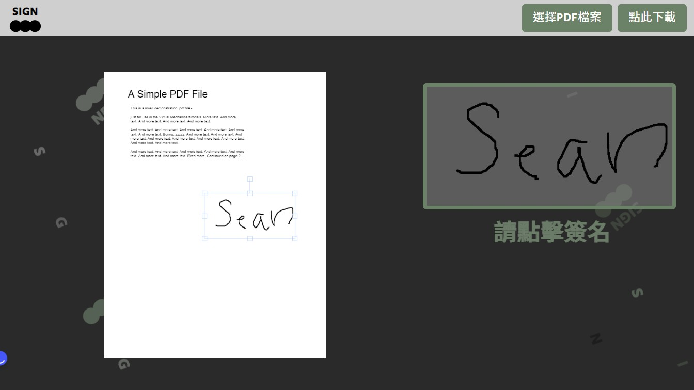

# F2E 2022 Sean Week2
# 

[網站連結](https://lashawty.github.io/f2e_2022_week2_sean/)

# 專案說明：

- html(pug)分為index/pdf

- css(sass)style.sass/reset.sass(元件、變數、mixin、字級設定)

- JS 使用jQuery、原生JS、GSAP套件、PDF套件、canvas套件

- 請使用1920x1080解析度預覽

# 互動說明

## 首頁
- 點擊sign nooow/簽署文件(右上角導覽列) 開啟簽名畫面
- 閱讀流程 點擊"建立簽名檔"
- 於白色區塊繪製簽名檔 按下"新增簽名"
- 可點擊"清除簽名" 清除已新增之簽名
- 點擊"確認簽名 前往上傳PDF"

## 上傳PDF
- 點擊"選擇PDF檔案"
- 出現檔案後 點擊簽名區塊
- 調整簽名大小及位置
- 點擊"點此下載"
